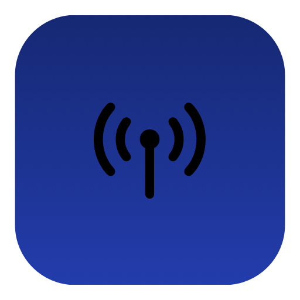

<p align="center">
  
</p>

<h1 align="center">KonnectMac</h1>

<p align="center">
  <strong>Connect your Android phone to your Mac.</strong><br>
  A native macOS KDE Connect client. Zero dependencies.
</p>

<p align="center">
  
  
  
  
  
</p>

---

<!-- TODO: Add hero demo GIF here -->
<!-- <p align="center"></p> -->

## What is KonnectMac?

KonnectMac is a **native macOS menu bar app** that connects your Android phone to your Mac using the [KDE Connect](https://kdeconnect.kde.org/) protocol. It works with the official KDE Connect Android app (v1.34+) available on [Google Play](https://play.google.com/store/apps/details?id=org.kde.kdeconnect_tp) and [F-Droid](https://f-droid.org/packages/org.kde.kdeconnect_tp/).

No Electron. No web views. No third-party dependencies. Pure Swift + AppKit + SwiftUI.

## Download

📦 **[Download KonnectMac](https://github.com/aryarajsingh/KonnectMac/releases/latest)** (.pkg installer)

> **Note:** The app is not code-signed yet, so macOS may show an "unidentified developer" warning. Right-click the app → Open to bypass.

## Features

| Feature | Description |
|---------|-------------|
| **Notification Mirroring** | See your phone notifications on your Mac with app icons and OTP auto-detection with one-tap copy |
| **Call Alerts** | Incoming/outgoing call notifications with automatic media pause and resume |
| **Clipboard Sync** | Bidirectional clipboard sharing between Mac and phone |
| **File Transfer** | Send and receive files over encrypted TLS — drag files to the menu bar icon |
| **Battery Monitor** | Phone battery level in the menu bar with low battery alerts |
| **Find My Phone** | Ring your phone from your Mac |
| **Ping** | Bidirectional ping to test connectivity |

## Setup

### Requirements
- macOS 14 (Sonoma) or later
- [KDE Connect](https://play.google.com/store/apps/details?id=org.kde.kdeconnect_tp) on your Android phone
- Both devices on the same WiFi network (or connected via [Tailscale](https://tailscale.com/))

### Getting Started
1. **Install** KonnectMac and KDE Connect on your phone
2. **Launch** KonnectMac — the onboarding wizard guides you through permissions
3. **Pair** — your phone appears automatically, click to pair and verify the security key
4. **Done** — look for the antenna icon in your menu bar

### OTP/SMS Visibility (Android 15+)

Android 15 hides sensitive notification content from third-party apps. To enable OTP/SMS visibility for KDE Connect:

```bash
brew install android-platform-tools
adb shell appops set org.kde.kdeconnect_tp RECEIVE_SENSITIVE_NOTIFICATIONS allow
```

The onboarding wizard covers this as well.

## How It Works

```
Mac                              Phone
 │                                 │
 ├──── UDP Broadcast ────────────► │  Discovery (ports 1714-1764)
 │ ◄──── TCP Connect ─────────────┤  Phone connects to Mac
 │                                 │
 ├──── TLS Handshake ────────────► │  Encrypted channel (self-signed certs)
 │ ◄──── Identity Exchange ───────┤  Both sides identify
 │                                 │
 ├──── Pair Request ─────────────► │  SHA256 verification key
 │ ◄──── Pair Accept ─────────────┤  Certificate pinned
 │                                 │
 │ ◄═══ Encrypted JSON Packets ══►│  Notifications, clipboard, files...
```

## Security

- **End-to-end TLS** on all channels (main connection, file transfers, icon downloads)
- **Certificate pinning** after pairing — rejects impersonators
- **SHA256 verification key** displayed during pairing for visual confirmation
- **App-specific keychain** — no login keychain prompts
- **No sensitive data in logs** — OTP codes, notification text, caller names, clipboard content are never logged

## Build from Source

### Requirements

- macOS 14 (Sonoma) or later
- Xcode 15+ (with Command Line Tools)

### Build

**Option A — Xcode (recommended)**

1. Open `KonnectMac.xcodeproj` in Xcode
2. Select the **KonnectMac** scheme → **Release** configuration
3. Press **Cmd+B** to build

**Option B — Command line**

```bash
git clone https://github.com/aryarajsingh/KonnectMac.git
cd KonnectMac
xcodebuild -project KonnectMac.xcodeproj -scheme KonnectMac -configuration Release build
```

### Run

**From Xcode:** Press **Cmd+R**.

**From the command line:** After building, the app is in your DerivedData folder. Open it directly:

```bash
open "$(xcodebuild -project KonnectMac.xcodeproj -scheme KonnectMac -configuration Release -showBuildSettings 2>/dev/null | grep -m1 'BUILT_PRODUCTS_DIR' | awk '{print $3}')/KonnectMac.app"
```

Or copy it to `/Applications` for regular use:

```bash
BUILT=$(xcodebuild -project KonnectMac.xcodeproj -scheme KonnectMac -configuration Release -showBuildSettings 2>/dev/null | grep -m1 'BUILT_PRODUCTS_DIR' | awk '{print $3}')
cp -R "$BUILT/KonnectMac.app" /Applications/
open /Applications/KonnectMac.app
```

> **Note:** macOS may warn about an unidentified developer on first launch. Right-click the app → **Open** to bypass.

### Create a .pkg installer

```bash
./build-pkg.sh
```

This builds the app in Release mode and generates `KonnectMac-1.3.pkg` in the project root. Double-click to install, or install from the command line:

```bash
sudo installer -pkg KonnectMac-1.3.pkg -target /
```

<details>
<summary><strong>Architecture</strong></summary>

```
KonnectMac/
├── KonnectMacApp.swift          — App entry, menu bar, onboarding
├── OnboardingView.swift         — First-launch setup wizard
├── PreferencesView.swift        — Settings: General, Devices, About
├── MenuBarView.swift            — Menu bar popover UI
├── Core/
│   ├── NetworkPacket.swift      — JSON packet serialization
│   ├── Config.swift             — UserDefaults, capabilities, identity
│   ├── Device.swift             — Device model
│   ├── DeviceManager.swift      — Discovery, connections, pairing
│   ├── CertificateManager.swift — TLS certificate generation & keychain
│   └── Logger.swift             — Thread-safe file logging with rotation
├── Network/
│   ├── UDPDiscovery.swift       — BSD socket UDP broadcast
│   ├── LanServer.swift          — BSD socket TCP server
│   ├── KDEConnection.swift      — Full TLS connection lifecycle
│   └── VerificationKeyHelper.swift — SHA256 pairing verification
├── Pairing/
│   └── PairingHandler.swift     — Pairing state machine & verification
└── Plugins/
    ├── PluginProtocol.swift     — Plugin interface
    ├── PingPlugin.swift         — Bidirectional ping
    ├── BatteryPlugin.swift      — Battery level & alerts
    ├── NotificationPlugin.swift — Notification mirroring & OTP detection
    ├── TelephonyPlugin.swift    — Call alerts & media control
    ├── ClipboardPlugin.swift    — Clipboard sync
    ├── FindMyPhonePlugin.swift  — Ring phone
    └── SharePlugin.swift        — File transfer
```

</details>

<details>
<summary><strong>Tech Stack</strong></summary>

| Component | Choice | Why |
|-----------|--------|-----|
| Language | Swift 5.9+ | Native, fast, type-safe |
| UI | SwiftUI + AppKit | SwiftUI for views, AppKit for menu bar & windows |
| Networking | BSD Sockets | Network.framework can't do TLS startTLS |
| TLS | SecureTransport | Ships with macOS, no dependencies |
| Certificates | openssl CLI + Keychain | Self-signed RSA-2048, app-specific keychain |
| Media Control | MediaRemote (private) | Only way to pause/resume without Accessibility |

</details>

## Branches

| Branch | Purpose |
|--------|---------|
| `stable` | Production releases |
| `beta` | Testing builds |
| `alpha` | Active development |

## Support Me

I built this in my free time because I wanted a proper Mac + Android experience. If KonnectMac is useful to you, a small sponsorship means a lot — it keeps development going.

<a href="https://github.com/sponsors/aryarajsingh"></a>

## License

KonnectMac is open source under the [GNU General Public License v3.0](LICENSE).
You are free to view, modify, and build from source.

Copyright © 2026 Aryaraj Singh.

---

<p align="center">
  Built with care for the Mac.
</p>
